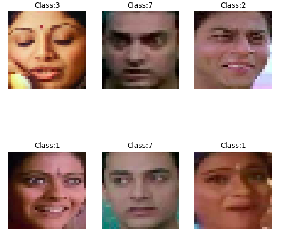

# Face-Classification

Face Classification and Verification with image features. 

The classification is done based on the following features:
- Eigen Faces / PCA 
- Kernel PCA
- Fisher Face / LDA
- Kernel Fisher Face
- VGG Features 
- Resnet Features

The classifier is tested using three face datasets
- Yale Face Dataset
- IMFDB
- IIIT-CFW

## Face Recognition
**Database** : IMFDB   
**Classification** : Classifies images based on face recognition

`imfdb_dict = {` 
    `'MadhuriDixit': 0,` 
    `'Kajol': 1,`  
    `'SharukhKhan': 2,`  
    `'ShilpaShetty': 3,`  
    `'AmitabhBachan': 4,`  
    `'KatrinaKaif': 5,`  
    `'AkshayKumar': 6,`  
    `'Amir': 7}`  

The following are few results of face recognition

## Gender Prediction
**Database** : IIIT-CFW  
**Classification** : Male/Female 

`Classify = {`  
    `Female = 1`  
    `Male = 0}`

The following are few results of gender classification 

Find the code and the output at [Jupyter Notebook](../master/Face_Classifier.ipynb) and a detailed report at [Report.pdf](../master/Report.pdf)

This is done as part of the Statistical Methods of AI course at IIIT-Hyderabad.